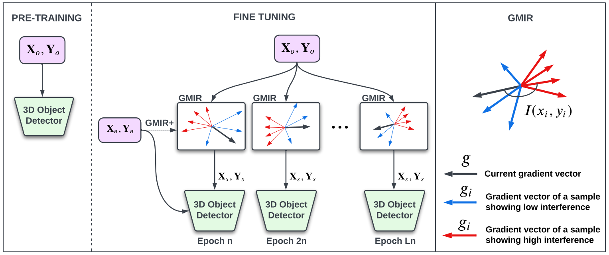

# GMIR
GMIR is a strategy to retrieve samples from old domain data that help alleviate forgetting while finetuning on new domain.
This repository is based off [`[OpenPCDet]`](https://github.com/open-mmlab/OpenPCDet).


**Gradient-based Maximally Interfered Retrieval for Domain Adaptive 3D Object
Detection**\
Barza Nisar, Vishal Kanna Anand, Steven L. Waslander\
**[[Paper]](https://arxiv.org/pdf/2304.14460.pdf)**



## Installation
Please refer to [INSTALL.md](docs/INSTALL.md) for the installation of `GMIR`.


## Getting Started
Please refer to [GETTING_STARTED.md](docs/GETTING_STARTED.md) to learn more usage about this project.

## License
`GMIR` is released under the [Apache 2.0 license](LICENSE).

## Acknowledgement
We would like to thank the authors of [`OpenPCDet`](https://github.com/open-mmlab/OpenPCDet) for their open source release of their codebase.

## Citation
If you find this project useful in your research, please consider citing:
```
@inproceedings{GMIR,
    title={{Gradient-based Maximally Interfered Retrieval for Domain Adaptive 3D Object Detection}},
    author={Nisar, Barza and
            Annand, Vishal Kanna and
            Waslander, Steven L.},
    booktitle={Conference on Computer and Robot Vision (CRV)},
    year={2023}
}
```
